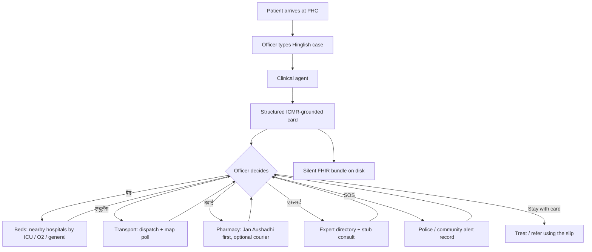
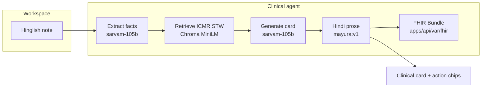
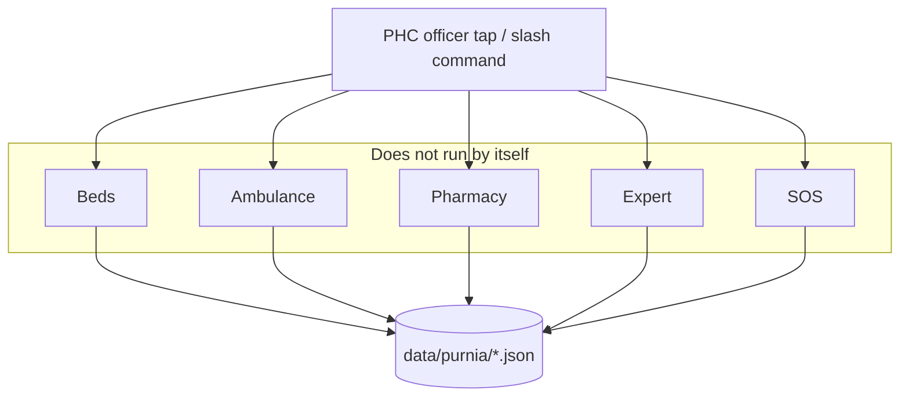

# Problem statement: ClinAssistIndia

Decision support for a lone medical officer at an Indian Primary Health Centre (PHC): Hinglish case notes, ICMR-grounded next steps at the desk, then **human-triggered** help for beds, ambulance, medicines, a specialist, or SOS.

This document is the **problem and the case workflow**. Implementation detail lives in [architecture.md](architecture.md). How to run the repo is in the [root README](../README.md). What is not built yet is in [roadmap.md](roadmap.md).

---

## Table of contents

1. [The desk](#1-the-desk)
2. [What fails today](#2-what-fails-today)
3. [Who this is for](#3-who-this-is-for)
4. [Job to be done](#4-job-to-be-done)
5. [Golden case (NSTEMI / ACS)](#5-golden-case-nstemi--acs)
6. [Scenarios](#6-scenarios)
7. [Workflow](#7-workflow)
8. [What this build does and does not](#8-what-this-build-does-and-does-not)
9. [Non-goals](#9-non-goals)
10. [Success at the desk](#10-success-at-the-desk)

---

## 1. The desk

It is morning at a rural PHC. One medical officer. A queue outside. A breathless middle-aged man walks in: sweating, BP 160/100, known diabetes, troponin slightly up. The nearest cardiologist is tens of kilometres away.

The officer does not need an essay. They need, in the next few minutes:

1. A working assessment they can defend from **ICMR Standard Treatment Workflows (STWs)**, not from a generic chatbot.
2. Steps that are **feasible at a PHC** (ECG, chewable aspirin, what *not* to give).
3. A referral slip and a way to **move** the patient (bed, ambulance).
4. If stock is short: a nearby **Jan Aushadhi** (or other pharmacy) and a way to fetch the drug.
5. If the card is not enough: a **human specialist**.
6. If the situation is unsafe: **police / community SOS**.

The note they type is rural Hinglish (`SOB 3 din se`, `sugar bhi hai`), not a discharge summary.

The public demo is anchored at **PHC Khajanchi Hat, Purnia East, Bihar (PIN 854301)** — a real block geography with curated nearby facilities. The same desk exists across rural India; Purnia is the POC node, not the only PHC that will ever need this.

---

## 2. What fails today

| Gap | What happens at the PHC |
|---|---|
| English-only guidelines | ICMR STWs exist as PDFs. The officer is staring at a queue, not a desktop of PDFs. |
| English-only models | `SOB 3 din se` is dropped or mistranslated; retrieval never sees “dyspnoea / ACS”. |
| Autonomous “agents” | A system that books an ambulance or texts a pharmacist *without* a tap is unsafe and legally unclear. |
| Live ops myth | HMIS bed feeds, GPS ambulances, and WhatsApp pharmacy checks are not on this desk today. Inventing them as RAG over prose is worse than a small, honest list. |
| Referral paperwork | The receiving hospital needs a slip (who, what was given, ECG, destination). That is not a chat bubble. |
| Language at the glass | Worker-facing steps must be readable in Hindi (Devanagari), with drug names and ICD codes left in Latin where that is safer. |

ClinAssistIndia is built against those gaps. It is **decision support**. It is not a device, not a diagnosis, and not an autonomous clinical actor. Final judgment stays with the treating clinician.

---

## 3. Who this is for

**Primary user:** medical officer / AYUSH / assigned clinician at a PHC or equivalent frontline public facility, often working alone.

**Not the primary user (this build):** the patient, the district cardiologist (except as a directory + stub consult), hospital bed managers, or ABDM national infrastructure.

**Secondary readers:** reviewers and contributors who need the *problem*, not the port numbers.

---

## 4. Job to be done

When a case lands at the PHC, the officer should be able to:

1. Type the case in **Hinglish, Hindi, or English**.
2. Get a **structured card**: urgency, assessment, working diagnosis + ICD-10 if the STW supports it, PHC steps, contraindications, referral slip, ICMR source lines.
3. **Choose** the next operational move. Nothing else runs until they tap it.
4. Leave a silent **ABDM-shaped FHIR** bundle on disk for later referral integration.

Specialized agents are **not** a swarm. They are buttons (and slash commands) on that card: **बेड**, **एम्बुलेंस**, **दवाई**, **एक्सपर्ट**, **SOS**.

```text
/clinical   /beds   /transport   /pharmacy   /expert   /sos
```

---

## 5. Golden case (NSTEMI / ACS)

This is the design case. The numbered steps below are an **illustrative card** of the *shape* the workspace should produce. Live Sarvam output is not canned and will not match this wording bit-for-bit.

**Input**

```text
Patient 45M, SOB 3 din se, BP 160/100, sugar bhi hai,
troponin slightly elevated. Kya karna chahiye?
```

**What the clinical path must do**

1. Extract facts (age, sex, symptoms, duration, vitals, labs, comorbidities) without inventing labs that were not typed.
2. Turn that into an English retrieval query (MiniLM is English).
3. Retrieve ICMR STW passages (unstable angina / NSTEMI, ACS, related cardiology STWs in the index).
4. Generate a `ClinicalCard` grounded on those passages: PHC-feasible steps, no invented doses.
5. Put worker-facing prose in Hindi Devanagari (Mayura). Keep drug names, ECG, ICD in Latin if needed.
6. Write a FHIR `Bundle` (`Encounter`, `MedicationRequest`s, `ServiceRequest` for referral) under `apps/api/var/fhir/`.

**Illustrative card (shape, not a recorded model transcript)**

| Field | Example of the kind of content |
|---|---|
| Urgency | Urgent — treat as possible NSTEMI / unstable angina until proven otherwise |
| Assessment | 45M; dyspnoea 3 days; BP 160/100; diabetes; troponin up → high ACS risk |
| Working diagnosis | Unstable angina / NSTEMI (ICD-10 as in the STW, e.g. I20.0 / I21.4 family) |
| PHC steps | 12-lead ECG now; chewable aspirin if no allergy; dual antiplatelet if the STW says so; IV access without flooding a hypertensive patient; oxygen only if SpO₂ needs it |
| Do-nots | NSAIDs; do not delay referral; do not send the patient to drive himself |
| Referral | District / GMC with cardiac capability; golden-hour language if the STW supports it |
| Sources | Retrieved STW title, PDF name, page/section quote — not MIMIC, not a random PubMed mix |
| Disclaimer | ClinAssist output is decision support only. Final clinical judgment rests with the treating clinician. |

Phase I retrieval is **ICMR STW PDFs in the local Chroma index only**. The original sketch mentioned MIMIC-IV discharge notes and India PubMed as extra corpora. Those are **not** in this build.

After the card, the officer — not the model — decides whether to look for an ICU bed, call an ambulance, find aspirin, ring a cardiologist, or raise SOS.

---

## 6. Scenarios

Each scenario is a **job at the desk**. The right-hand column is what the **current POC** actually does versus the longer vision.

### 6.1 Clinical guidance (core)

The officer needs ICMR-grounded next steps for this patient, in language they can use on the floor.

| Vision | This POC |
|---|---|
| Native Hinglish in → structured card out | **Shipped.** Sarvam `sarvam-105b` extract + generate, Chroma MiniLM over ingested STWs, Mayura Hindi |
| Grounding on official Indian STWs | **Shipped** for the ingested set (ACS / NSTEMI, STEMI-related, HF via cardiology pack, endocrinology / diabetes). Not all of ICMR |
| Silent FHIR for ABDM referral | **Shipped to disk** (`apps/api/var/fhir/`). Not POSTed to an ABDM sandbox |

### 6.2 Human expert (when the card is not enough)

The officer is not satisfied with the card and wants an L2 clinician (cardiologist / physician on call).

| Vision | This POC |
|---|---|
| Directory of nearby specialists with availability (in person / on call) | **Shipped** as curated `data/purnia/experts.json` (distance from the PHC, availability flags) |
| Connect for a live second opinion on the ICMR-grounded card | **Stub.** Creates a consult record (`connecting` / `connected` / `queued`). **No WebRTC, no phone bridge** |

The expert agent does **not** start because the card looks “urgent”. The officer taps **एक्सपर्ट**.

### 6.3 Beds and transport (operations)

The officer needs a bed (ICU / oxygen / general) at a nearby primary, secondary, or tertiary facility, then a vehicle that can move the patient.

**Beds**

| Vision | This POC |
|---|---|
| Live vacancy (government + private) | **Not live.** Curated `hospitals.json` with POC bed *estimates* and `accepts_nstemi` |
| Rank by need, ACS capability, distance | **Shipped** (deterministic sort, Haversine from PHC Khajanchi Hat) |
| Notify the receiving emergency desk | **Not shipped** (no WhatsApp / phone blast) |

**Ambulance / volunteer vehicle**

| Vision | This POC |
|---|---|
| Live fleet (108, private, volunteer cars) | **Not live.** Curated `ambulances.json` |
| Dispatch to the PHC and track like a delivery map | **Shipped as simulation:** HTTP poll every 3s along a polyline. Not GPS, not a radio network |

Ops data is **JSON**, not a vector database. Semantic search is the wrong tool for “how many ICU beds” and “is this vehicle free”.

### 6.4 Medicines (pharmacist)

PHC stock is short (e.g. aspirin, clopidogrel). The officer needs a nearby source, Jan Aushadhi first.

| Vision | This POC |
|---|---|
| Live stock enquiry (WhatsApp / SMS to the chemist) | **Not shipped** |
| Jan Aushadhi (PMBJK) before private retail | **Shipped** in search order |
| Volunteer courier + live track | **Shipped as simulation** (same 3s poll as transport) |

### 6.5 Law enforcement / community SOS

The officer needs police, administration, or community volunteers (crowd, threat, escort).

| Vision | This POC |
|---|---|
| Directory of thana / ASHA / volunteers | **Shipped** (`sos_contacts.json`) |
| Automated SOS (SMS / WhatsApp / 112 integration) | **Record only.** In-app alert with contacts; **no outbound message** |
| Track acknowledgement in real time | **Shipped as a stub clock** (`pending` → `acked` after a few seconds) |

---

## 7. Workflow

Agents never chain themselves. The officer is the orchestrator.

### 7.1 End-to-end at the desk



### 7.2 Clinical path (only path that calls the LLM)

Hinglish is **not** embedded as-is. Facts are extracted to English, then MiniLM retrieves STW chunks, then the card is generated and translated.



Temperature on the completion client is **0**. Wording can still vary across Sarvam/Mayura calls; do not treat the golden case table as a fixture.

### 7.3 Human trigger vs ops data



Map markers and “live” vehicle motion are UI polling (`GET /v1/transport/{id}/track` and courier equivalent) every three seconds against the simulator, not a GPS feed.

---

## 8. What this build does and does not

| Piece | This build |
|---|---|
| ICMR STW PDFs → Chroma MiniLM | Real retrieval after `python -m app.rag.ingest` |
| Sarvam `sarvam-105b` extract + card | Real API; needs `SARVAM_API_KEY` |
| Mayura Hindi | Real API; same key |
| Purnia hospitals / pharmacies / experts / SOS | Curated JSON, not live government feeds |
| Ambulance / courier movement | Simulated HTTP poll, 3s |
| WhatsApp, SMS, ABDM POST, WebRTC | **Not** in this build |
| FHIR | Written under `apps/api/var/fhir/`; not posted to ABDM |
| Prompt optimizer | **Developer only** (LatentCode skill on `EXTRACT_SYSTEM` / `GENERATE_SYSTEM`). Not on the live consult path. See [architecture.md §4.1](architecture.md#41-developer-prompt-optimizer) |

Demo node: **PHC Khajanchi Hat, Purnia, Bihar**. Ports for this checkout: UI **3002**, API **8002**.

---

## 9. Non-goals

For this POC, explicitly out of scope:

- Autonomous multi-agent loops (CrewAI-style agents calling each other).
- Using a vector index as the source of truth for beds, stock, or vehicle state.
- Replacing the clinician, or emitting a legally binding diagnosis.
- Full ICMR corpus (snakebite, maternal, sepsis, …) — only the ingested STWs.
- National ABDM write-back, HMIS, 108 CAD, or production auth / multi-PHC tenancy.

Those belong on the [roadmap](roadmap.md), not on the golden path.

---

## 10. Success at the desk

A reviewer (or the officer) should be able to:

1. Paste the golden NSTEMI line, get a **card** (not a paragraph), with ICMR source lines and a disclaimer.
2. Tap **बेड → एम्बुलेंस → दवाई → एक्सपर्ट → SOS** in any order they choose; none of those fire before the tap.
3. See the PHC and hospitals on the map; see a dispatched vehicle **move** (simulated).
4. With `?debug=1`, see a FHIR encounter id; the JSON sits under `apps/api/var/fhir/`.
5. Understand that **ops JSON is deterministic** and the **clinical wording is not**.

If those five hold, the problem this repo set out to show is covered. Everything else is the next mile, not the problem statement.
